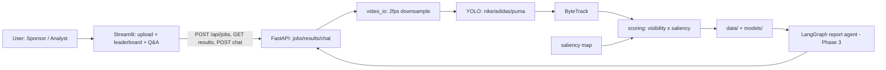
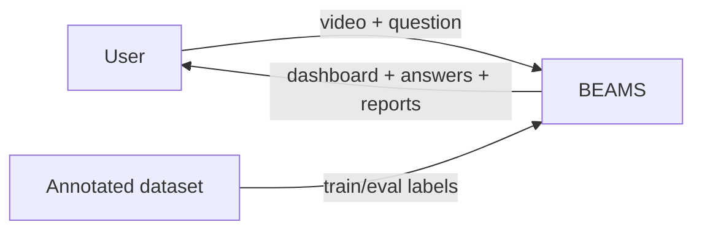
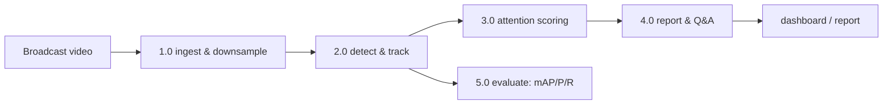
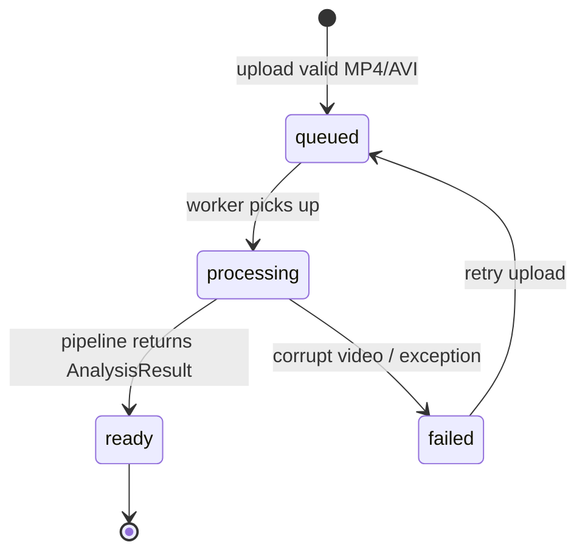

# BEAMS Architecture (starter)

`Streamlit --REST/poll--> FastAPI --> engine.pipeline --> data/models`
No websockets — polling is enough until live-broadcast phase.

## DFD Level-0

## DFD Level-1

## Job state diagram

> Pretty PNGs for the report: `uv run python docs/diagrams_arch.py` (needs graphviz).
